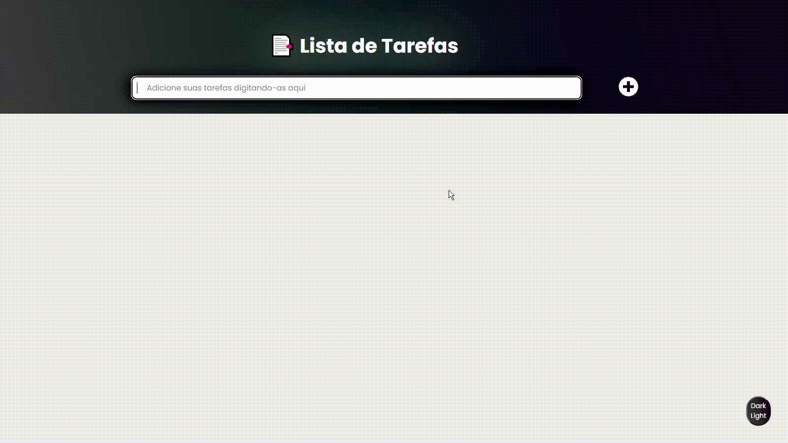
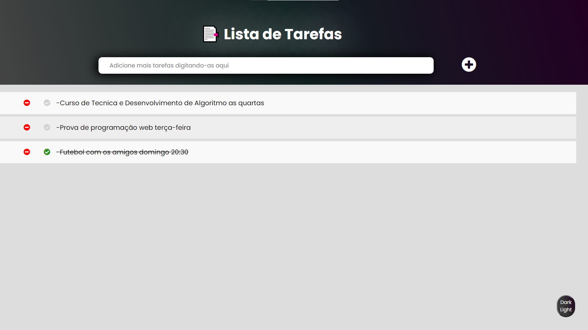
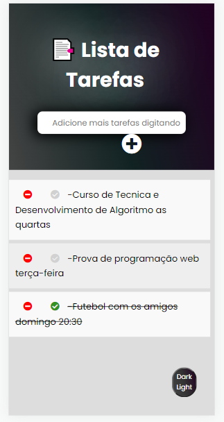

<h1 align="center">

</h1>

<h2 align="center"> 📎 Acesse o projeto online em: 
<a href="https://gustabriel.github.io/lista-de-tarefas/">https://gustabriel.github.io/lista-de-tarefas/</a> </h2>

  
 
     Preview do site no modo desktop 💻
  

   <h1 style="margin: auto">
   
   </h1>

  
 
     Preview do site no modo mobile 📱
  

   <h1 style="margin: auto">
   
   </h1>

 

# 📝 Sobre:
## Projeto "Lista de Tarefas", desenvolvido com base nas aulas de programação web da faculdade, onde está sendo aprimorada as técnicas em JavaScript.
 

# 💾 Tecnologias utilizadas:
### O Projeto foi desenvolvido utilizando as seguintes tecnologias:

- CSS;
- HTML;
- JavaScript;
 

# 🥇 Aprendizagem durante o projeto:
### - Foi aprendido como gravar dados num "server" local, que é o localStorage e também diversos métodos e tecnicas em JavaScript.  
### - Ainda pretendo aprimorar o site e adicionar mais algumas funcionalidades. 
---
 

<h3 align="center"> 📌 Desenvolvido por: <a href="https://www.linkedin.com/in/gabriel-gustavo31/">Gabriel Gustavo</a>;
</h3>
<h1 align="center"></h1>

 

<h4 align="center"> ⌛⏳ "Projeto ainda em evolução" ⌛⏳ </h4>

